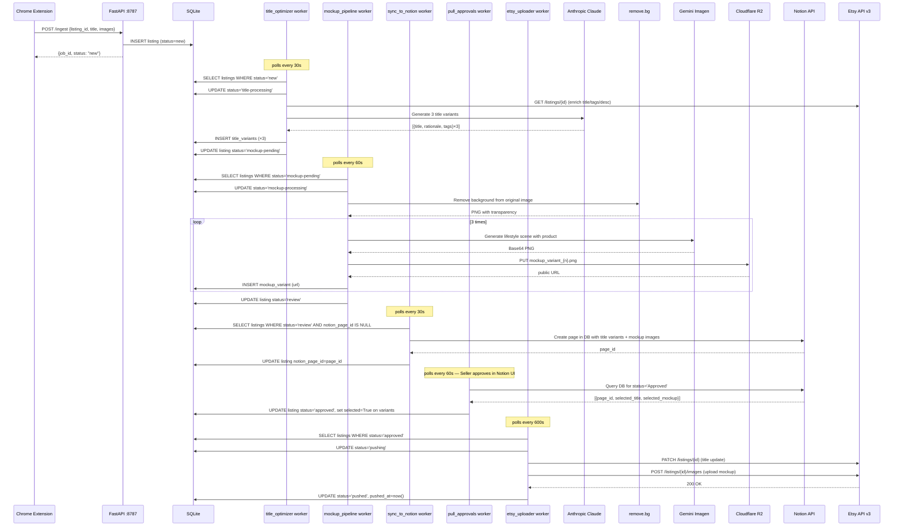
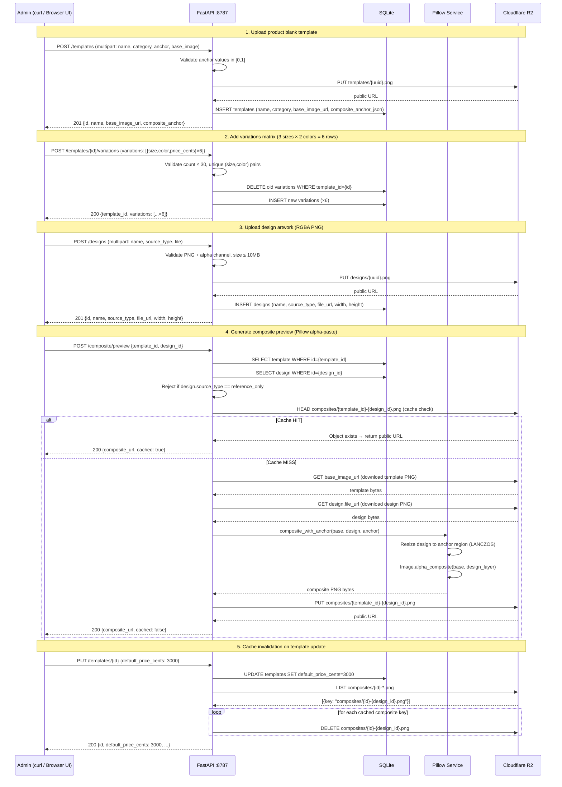
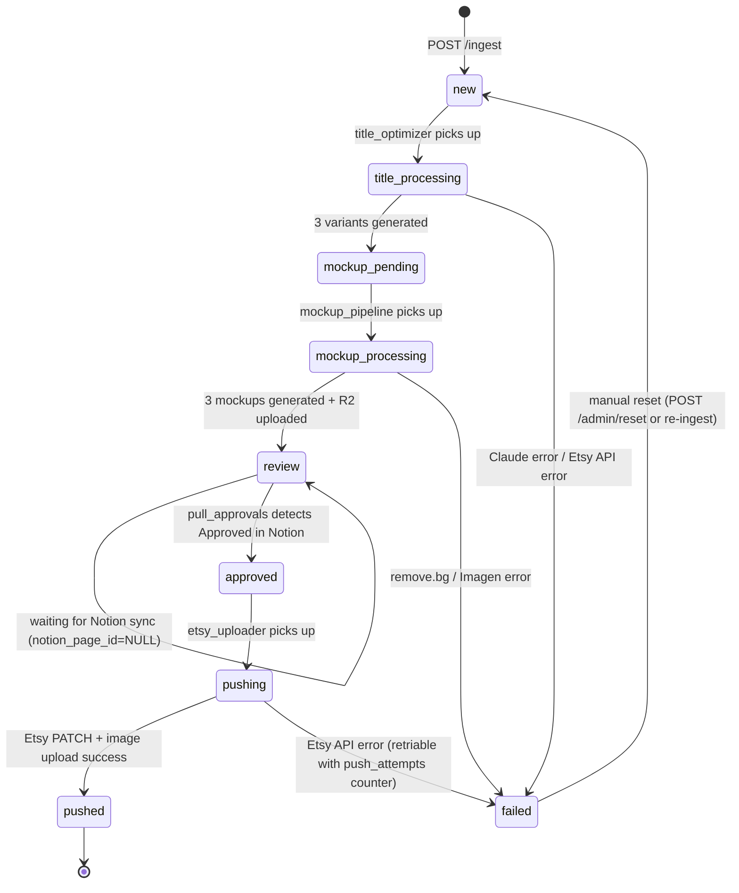
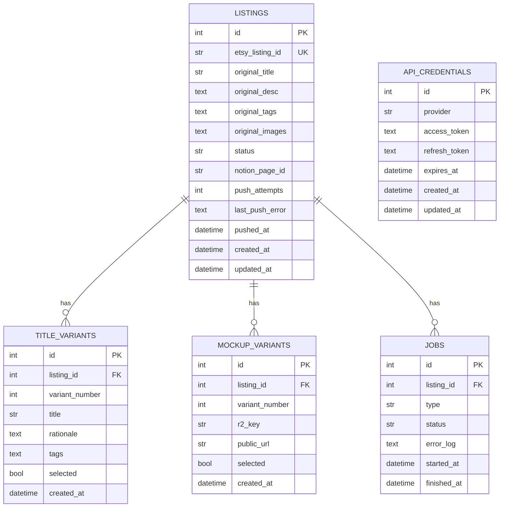

# System Architecture

## Component Overview

```
┌─────────────────────────────────────────────────────────────────────┐
│  Seller's Machine (localhost)                                        │
│                                                                      │
│  ┌──────────────────┐        ┌──────────────────────────────────┐   │
│  │  Chrome Browser  │        │  FastAPI Backend  :8787           │   │
│  │  ┌────────────┐  │  HTTP  │  ┌────────────┐  ┌────────────┐  │   │
│  │  │  Side Panel│◄─┼────────┼─►│  /ingest   │  │  /health   │  │   │
│  │  │  (UI)      │  │        │  │  /auth/etsy│  │  /admin    │  │   │
│  │  └────────────┘  │        │  └────────────┘  └────────────┘  │   │
│  │  ┌────────────┐  │        │                                   │   │
│  │  │  Content   │  │        │  ┌──────────────────────────────┐ │   │
│  │  │  Script    │  │        │  │  APScheduler (BackgroundSched)│ │   │
│  │  │  (detect   │  │        │  │  • title_optimizer    (30s)  │ │   │
│  │  │   listing) │  │        │  │  • mockup_pipeline    (60s)  │ │   │
│  │  └────────────┘  │        │  │  • sync_to_notion     (30s)  │ │   │
│  │  ┌────────────┐  │        │  │  • pull_approvals     (60s)  │ │   │
│  │  │  Service   │  │        │  │  • etsy_uploader      (600s) │ │   │
│  │  │  Worker    │  │        │  └──────────────────────────────┘ │   │
│  │  └────────────┘  │        │                                   │   │
│  └──────────────────┘        │  ┌──────────────────────────────┐ │   │
│                               │  │  SQLite (etsyauto.db)        │ │   │
│                               │  │  • listings                  │ │   │
│                               │  │  • title_variants            │ │   │
│                               │  │  • mockup_variants           │ │   │
│                               │  │  • jobs                      │ │   │
│                               │  │  • api_credentials           │ │   │
│                               │  └──────────────────────────────┘ │   │
│                               └──────────────────────────────────┘   │
└─────────────────────────────────────────────────────────────────────┘
        │                │              │             │
        ▼                ▼              ▼             ▼
   Etsy API v3     Anthropic API   Google Gemini   remove.bg
   (OAuth PKCE)    (Claude Sonnet) (Imagen)        (REST API)
        │
        ▼
   Cloudflare R2 ◄──────────────────────────────────────────
   (Image store)                                             │
        │                                                    │
        ▼                                                    │
   Notion API ─────────────────────────────────────► Seller Review
   (DB + page)                                       (Notion UI)
```

## Data Flow Sequence



## Template System Flow (Sub-feature B)



## Idea → Listing Flow (v0.8.0)

```
                   ┌─────────────────────────┐
                   │  Etsy public API v3      │
                   │  /listings/active        │
                   └──────────┬──────────────┘
                              │ keyword search (x-api-key)
                              ▼
   ┌─────────────────┐   ┌──────────────────────────────┐
   │ APScheduler     │──▶│ idea_miner_service           │
   │ (hourly)        │   │ - per-keyword search          │
   └─────────────────┘   │ - get_listing detail          │
                         │ - upsert idea + signal        │
                         │ - fail-closed per listing     │
                         └──────────┬───────────────────┘
                                    │
                                    ▼
   ┌──────────────────────────────────────────────────┐
   │ SQLite (4-layer schema)                           │
   │ ┌──────────────────────────────────────────────┐ │
   │ │ keywords (id, term, enabled, last_run_at)    │ │
   │ │ ideas (UNIQUE source+source_listing_id,       │ │
   │ │   status: new|saved|drafted|dismissed)        │ │
   │ │ idea_signals (timeseries — favorers/views)    │ │
   │ │ idea_to_listing (idea_id, listing_id) PK      │ │
   │ └──────────────────────────────────────────────┘ │
   └──────────────────────────────────────────────────┘
                                    │
            ┌───────────────────────┼─────────────────────┐
            ▼                       ▼                     ▼
   ┌───────────────────┐  ┌──────────────────┐  ┌────────────────────┐
   │ POST /extension/  │  │ /admin/keywords  │  │ /admin/ideas/{id}/ │
   │ idea (passive log │  │ /admin/ideas     │  │ create-listing →   │
   │ from extension v3 │  │ velocity sort    │  │ wizard 3-step →    │
   │ reference mode)   │  │ status filters   │  │ listing_creator    │
   └───────────────────┘  └──────────────────┘  └────────────────────┘
                                                         │
                                                         ▼
                                                   ┌──────────────┐
                                                   │ Etsy draft   │
                                                   │ + idea_to_   │
                                                   │ listing link │
                                                   │ + status=    │
                                                   │   drafted    │
                                                   └──────────────┘
```

**4-layer idea schema:**
- `keywords` — user-managed search terms; `enabled` gates miner; `last_run_at` for ops visibility
- `ideas` — `UNIQUE(source, source_listing_id)` deduplicates; `status` ∈ {new, saved, drafted, dismissed}; carries `reference_image_url`, `tags_json`, `price_cents`, taxonomy fields
- `idea_signals` — append-only timeseries `(idea_id, captured_at, num_favorers, views_all_time)`; velocity computed via `velocity_per_day(idea_id)` query
- `idea_to_listing` — composite-PK provenance link; populated on wizard submit

**Wizard stateless:** idea_id in URL only; each step recomputes prefill — no server session.
**Reuses listing_creator_service** end-to-end for Step 3 (no duplicated Etsy push logic).

## Status State Machine



## Database Schema



## Directory Structure

```
etsyauto/
├── backend/                    # FastAPI backend
│   ├── app/
│   │   ├── main.py             # App entrypoint, lifespan, CORS, routers
│   │   ├── config.py           # Pydantic Settings (loads .env)
│   │   ├── database.py         # SQLAlchemy engine + session factory
│   │   ├── scheduler.py        # APScheduler singleton + job registration
│   │   ├── routes/
│   │   │   ├── health.py       # GET /health
│   │   │   ├── ingest.py       # POST /ingest
│   │   │   ├── etsy_auth.py    # GET /auth/etsy/start|callback|status
│   │   │   └── admin.py        # POST /admin/run-uploader
│   │   ├── models/
│   │   │   ├── listing.py
│   │   │   ├── title_variant.py
│   │   │   ├── mockup_variant.py
│   │   │   ├── job.py
│   │   │   └── api_credential.py
│   │   ├── workers/
│   │   │   ├── title_optimizer.py   # Claude title generation
│   │   │   ├── mockup_pipeline.py   # remove.bg + Imagen + R2
│   │   │   ├── notion_sync.py       # sync_to_notion + pull_approvals
│   │   │   └── etsy_uploader.py     # Push to Etsy + retry
│   │   ├── services/
│   │   │   ├── listing_service.py   # DB queries + status transitions
│   │   │   ├── image_service.py     # PIL image utilities
│   │   │   ├── review_service.py    # Notion review logic
│   │   │   └── retry_policy.py      # Exponential backoff helpers
│   │   ├── clients/
│   │   │   ├── claude_client.py
│   │   │   ├── etsy_api_client.py
│   │   │   ├── etsy_oauth.py        # PKCE flow
│   │   │   ├── gemini_imagen_client.py
│   │   │   ├── notion_client.py
│   │   │   ├── r2_storage_client.py
│   │   │   └── removebg_client.py
│   │   └── prompts/                 # Claude system/user prompt templates
│   ├── alembic/                     # DB migrations
│   ├── tests/                       # pytest unit tests (78 tests)
│   ├── pyproject.toml
│   └── .env                         # (git-ignored) API keys
├── extension/                  # Chrome MV3 extension
│   ├── manifest.json           # MV3 manifest
│   ├── background/
│   │   └── service-worker.js   # Background service worker
│   ├── side-panel/
│   │   ├── side-panel.html
│   │   ├── side-panel.js
│   │   └── side-panel.css
│   ├── content-scripts/
│   │   ├── listing-detector.js
│   │   └── listing-detector.css
│   ├── shared/                  # Shared utilities
│   └── icons/
├── docs/                        # Project documentation
├── scripts/
│   ├── smoke-test-e2e.sh        # Structural readiness smoke test
│   └── seed-test-listing.py     # Insert fake listing for debugging
└── README.md
```

## Scheduler Job Timing

| Job | Interval | Trigger Condition | Max Instances |
|-----|----------|-------------------|---------------|
| `title_optimizer` | 30s | `status = 'new'` | 1 |
| `sync_to_notion` | 30s | `status = 'review'` AND `notion_page_id IS NULL` | 1 |
| `pull_approvals` | 60s | Notion query for `status = 'Approved'` | 1 |
| `mockup_pipeline` | 60s | `status = 'mockup-pending'` | 1 |
| `etsy_uploader` | 600s | `status = 'approved'` | 1 |

## Security Boundaries

- All API keys stored in `backend/.env` (never committed to git)
- Admin endpoints protected by `X-Admin-Token` header
- Etsy OAuth uses PKCE (no client_secret transmitted during token exchange)
- CORS restricted to `chrome-extension://*` and `localhost` origins only
- R2 bucket: public read for image embeds; write requires scoped API token
- Notion: Internal Integration token — access scoped to shared database only
